第三周：浅层神经网络(Shallow neural networks)
---------------------------------------------
[TOC]
### 3.1 神经网络概述（Neural Network Overview）

本周你将学习如何实现一个神经网络。在我们深入学习具体技术之前，我希望快速的带你预览一下本周你将会学到的东西。如果这个视频中的某些细节你没有看懂你也不用担心，我们将在后面的几个视频中深入讨论技术细节。

现在我们开始快速浏览一下如何实现神经网络。上周我们讨论了逻辑回归，我们了解了这个模型(见图3.1.1)如何与下面公式3.1建立联系。
图3.1.1 :

公式3.1：
$$
\left.
	\begin{array}{l}
	x\\
	w\\
	b
	\end{array}
	\right\}
	\implies{z={w}^Tx+b}
$$

如上所示，首先你需要输入特征$x$，参数$w$和$b$，通过这些你就可以计算出$z$，公式3.2：
$$
\left.
	\begin{array}{l}
	x\\
	w\\
	b
	\end{array}
	\right\}
	\implies{z={w}^Tx+b}
	\implies{a = \sigma(z)}\\ 
	\implies{{L}(a,y)}
$$

接下来使用$z$就可以计算出$a$。我们将的符号换为表示输出$\hat{y}\implies{a = \sigma(z)}$,然后可以计算出**loss function** $L(a,y)$

神经网络看起来是如下这个样子（图3.1.2）。正如我之前已经提到过，你可以把许多**sigmoid**单元堆叠起来形成一个神经网络。对于图3.1.1中的节点，它包含了之前讲的计算的两个步骤：首先通过公式3.1计算出值$z$，然后通过$\sigma(z)$计算值$a$。

- 网友：x[0]是原始输入。
- 网友：每层都有W和b，上一层输出作为下一层的输入，这里的上标表示第几层。
- 网友：上标表示对应的层数，小标是该层数对应的第几个节点，

图3.1.2

在这个神经网络（图3.1.2）对应的3个节点，首先计算第一层网络中的各个节点相关的数$z^{[1]}$，接着计算$\alpha^{[1]}$，在计算下一层网络同理；
**我们会使用符号$^{[m]}$表示第$m$层网络中节点相关的数，这些节点的集合被称为第$m$层网络。这样可以保证$^{[m]}$不会和我们之前用来表示单个的训练样本的$^{(i)}$(即我们使用表示第$i$个训练样本)混淆**；
整个计算过程，公式如下:
公式3.3：
$$
\left.
	\begin{array}{r}
	{x }\\
	{W^{[1]}}\\
	{b^{[1]}}
	\end{array}
	\right\}
	\implies{z^{[1]}=W^{[1]}x+b^{[1]}}
	\implies{a^{[1]} = \sigma(z^{[1]})}
$$
公式3.4：
$$
\left.
	\begin{array}{r}
	\text{$a^{[1]} = \sigma(z^{[1]})$}\\
	\text{$W^{[2]}$}\\
	\text{$b^{[2]}$}\\
	\end{array}
	\right\}
	\implies{z^{[2]}=W^{[2]}a^{[1]}+b^{[2]}}
	\implies{a^{[2]} = \sigma(z^{[2]})}\\ 
	\implies{{L}\left(a^{[2]},y \right)}
$$

类似逻辑回归，在计算后需要使用计算，接下来你需要使用另外一个线性方程对应的参数计算$z^{[2]}$，
计算$a^{[2]}$，此时$a^{[2]}$就是整个神经网络最终的输出，用 $\hat{y}$表示网络的输出。

公式3.5：
$$
\left.
	\begin{array}{r}
	{da^{[1]} = {d}\sigma(z^{[1]})}\\
	{dW^{[2]}}\\
	{db^{[2]}}\\
	\end{array}
	\right\}
	\impliedby{{dz}^{[2]}={d}(W^{[2]}\alpha^{[1]}+b^{[2]}})
	\impliedby{{{da}^{[2]}} = {d}\sigma(z^{[2]})}\\
	\impliedby{{dL}\left(a^{[2]},y \right)}
$$

我知道这其中有很多细节，其中有一点非常难以理解，即在逻辑回归中，通过直接计算$z$得到结果$a$。而这个神经网络中，我们反复的计算$z$和$a$，计算$a$和$z$，最后得到了最终的输出**loss function**。

你应该记得逻辑回归中，有一些从后向前的计算用来计算导数$da$、$dz$。同样，在神经网络中我们也有从后向前的计算，看起来就像这样，最后会计算$da^{[2]}$ 、$dz^{[2]}$，计算出来之后，然后计算计算$dW^{[2]}$、$db^{[2]}$ 等，按公式3.4、3.5箭头表示的那样，从右到左反向计算。

现在你大概了解了一下什么是神经网络，基于逻辑回归重复使用了两次该模型得到上述例子的神经网络。我清楚这里面多了很多新符号和细节，如果没有理解也不用担心，在接下来的视频中我们会仔细讨论具体细节。

那么，下一个视频讲述神经网络的表示。

### 3.2 神经网络的表示（Neural Network Representation）

先回顾一下我在上一个视频画几张神经网络的图片，在这次课中我们将讨论这些图片的具体含义，也就是我们画的这些神经网络到底代表什么。

我们首先关注一个例子，本例中的神经网络只包含一个隐藏层（图3.2.1）。这是一张神经网络的图片，让我们给此图的不同部分取一些名字。

图3.2.1

我们有输入特征$x_1$、$x_2$、$x_3$，它们被竖直地堆叠起来，这叫做神经网络的**输入层**。它包含了神经网络的输入；然后这里有另外一层我们称之为**隐藏层**（图3.2.1的四个结点）。待会儿我会回过头来讲解术语"隐藏"的意义；在本例中最后一层只由一个结点构成，而这个只有一个结点的层被称为**输出层**，它负责产生预测值。解释隐藏层的含义：在一个神经网络中，当你使用监督学习训练它的时候，训练集包含了输入$x$也包含了目标输出$y$，所以术语隐藏层的含义是在训练集中，这些中间结点的准确值我们是不知道到的，也就是说你看不见它们在训练集中应具有的值。**你能看见输入的值，你也能看见输出的值，但是隐藏层中的东西，在训练集中你是无法看到的**。所以这也解释了词语隐藏层，只是表示你无法在训练集中看到他们。

现在我们再引入几个符号，就像我们之前用向量$x$表示输入特征。**这里有个可代替的记号$a^{[0]}$可以用来表示输入特征。$a$表示激活的意思，它意味着网络中不同层的值会传递到它们后面的层中**，输入层将$x$传递给隐藏层，所以我们将输入层的激活值称为$a^{[0]}$；下一层即隐藏层也同样会产生一些激活值，那么我将其记作$a^{[1]}$，所以具体地，这里的第一个单元或结点我们将其表示为$a^{[1]}_{1}$，第二个结点的值我们记为$a^{[1]}_{2}$以此类推。所以这里的是一个四维的向量如果写成**Python**代码，那么它是一个规模为4x1的矩阵或一个大小为4的列向量，如下公式，它是四维的，因为在本例中，我们有四个结点或者单元，或者称为四个隐藏层单元；
公式3.7
$$
a^{[1]} =
	\left[
		\begin{array}{ccc}
		a^{[1]}_{1}\\
		a^{[1]}_{2}\\
		a^{[1]}_{3}\\
		a^{[1]}_{4}
		\end{array}
		\right]
$$

最后输出层将产生某个数值$a$，它只是一个单独的实数，所以的$\hat{y}$值将取为$a^{[2]}$。这与逻辑回归很相似，在逻辑回归中，我们有$\hat{y}$直接等于$a$，在逻辑回归中我们只有一个输出层，所以我们没有用带方括号的上标。但是在神经网络中，我们将使用这种带上标的形式来明确地指出这些值来自于哪一层，有趣的是在约定俗成的符号传统中，在这里你所看到的这个例子，只能叫做一个两层的神经网络（图3.2.2）。**原因是当我们计算网络的层数时，输入层是不算入总层数内**，所以隐藏层是第一层，输出层是第二层。第二个惯例是我们将输入层称为第零层，所以在技术上，这仍然是一个三层的神经网络，因为这里有输入层、隐藏层，还有输出层。但是在传统的符号使用中，如果你阅读研究论文或者在这门课中，你会看到人们将这个神经网络称为一个两层的神经网络，因为我们不将输入层看作一个标准的层。

图3.2.2

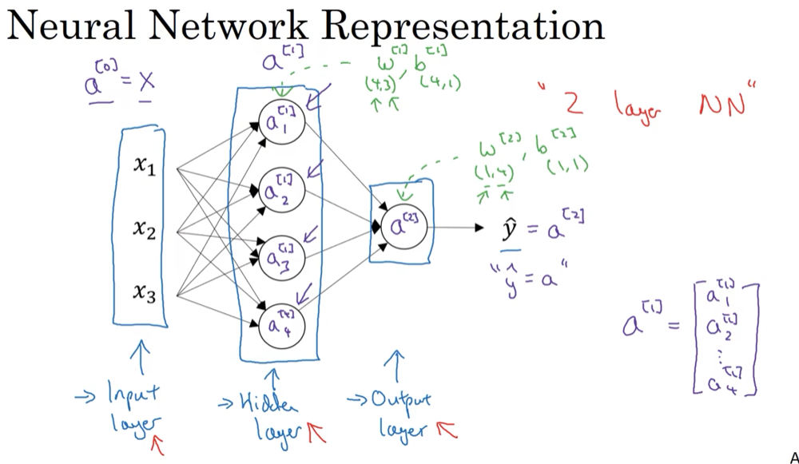

最后，我们要看到的隐藏层以及最后的输出层是带有参数的，这里的隐藏层将拥有两个参数$W$和$b$，我将给它们加上上标$^{[1]}$($W^{[1]}$,$b^{[1]}$)，表示这些参数是和第一层这个隐藏层有关系的。**之后在这个例子中我们会看到$W$是一个4x3的矩阵，而$b$是一个4x1的向量，第一个数字4源自于我们有四个结点或隐藏层单元，然后数字3源自于这里有三个输入特征**，我们之后会更加详细地讨论这些矩阵的维数，到那时你可能就更加清楚了。相似的输出层也有一些与之关联的参数$W^{[2]}$以及$b^{[2]}$。从维数上来看，它们的规模分别是1x4以及1x1。1x4是因为隐藏层有四个隐藏层单元而输出层只有一个单元，之后我们会对这些矩阵和向量的维度做出更加深入的解释，所以现在你已经知道一个两层的神经网络什么样的了，即它是一个只有一个隐藏层的神经网络。

在下一个视频中。我们将更深入地了解这个神经网络是如何进行计算的，也就是这个神经网络是怎么输入$x$，然后又是怎么得到$\hat{y}$。

### 3.3 计算一个神经网络的输出（Computing a Neural Network's output）

在上一节的视频中，我们介绍只有一个隐藏层的神经网络的结构与符号表示。在这节的视频中让我们了解神经网络的输出究竟是如何计算出来的。

首先，回顾下只有一个隐藏层的简单两层**神经网络结构**：

图3.3.1

其中，$x$表示输入特征，$a$表示每个神经元的输出，$W$表示特征的权重，上标表示神经网络的层数（隐藏层为1），下标表示该层的第几个神经元。这是神经网络的**符号惯例**，下同。

**神经网络的计算**

关于神经网络是怎么计算的，从我们之前提及的逻辑回归开始，如下图所示。用圆圈表示神经网络的计算单元，**逻辑回归的计算有两个步骤**，首先你按步骤计算出$z$，然后在第二步中你以**sigmoid**函数为激活函数计算$z$（得出$a$），一个神经网络只是这样子做了好多次重复计算。

图3.3.2

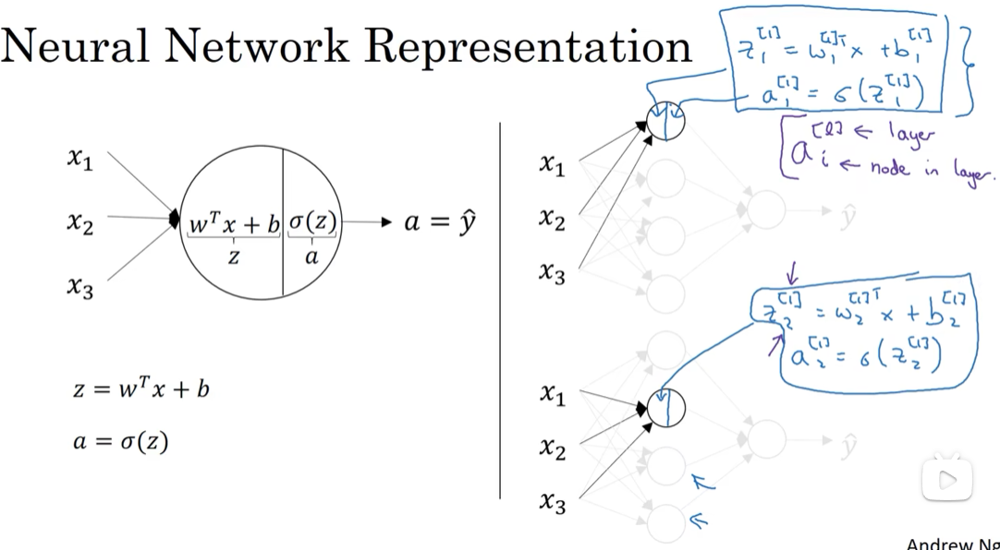

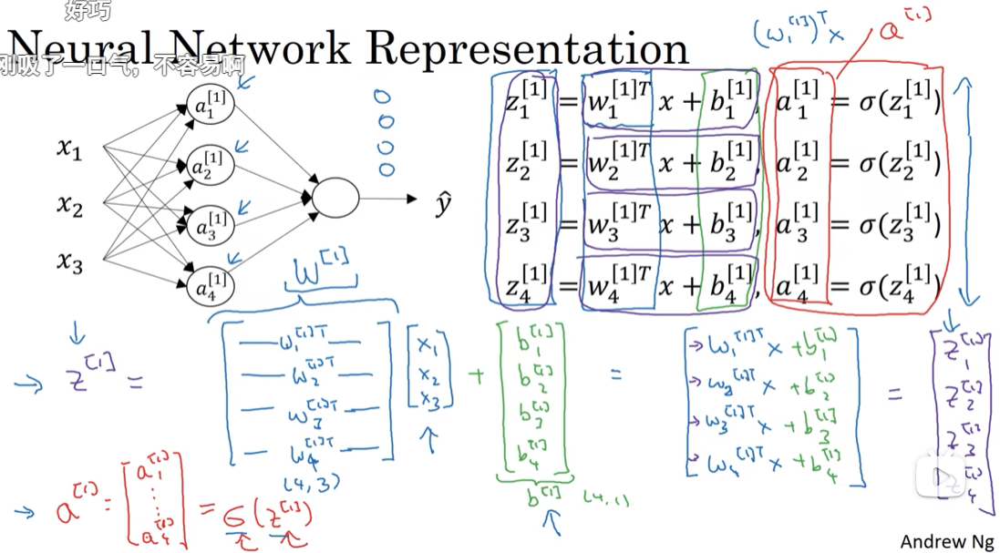

回到两层的神经网络，我们从隐藏层的第一个神经元开始计算，如上图第一个最上面的箭头所指。从上图可以看出，输入与逻辑回归相似，这个神经元的计算与逻辑回归一样分为两步，小圆圈代表了计算的两个步骤。

第一步，计算$z^{[1]}_1,z^{[1]}_1 = w^{[1]T}_1x + b^{[1]}_1$。

第二步，通过激活函数计算$a^{[1]}_1,a^{[1]}_1 = \sigma(z^{[1]}_1)$。

隐藏层的第二个以及后面两个神经元的计算过程一样，只是注意符号表示不同，最终分别得到$a^{[1]}_2、a^{[1]}_3、a^{[1]}_4$，详细结果见下:

$z^{[1]}_1 = w^{[1]T}_1x + b^{[1]}_1, a^{[1]}_1 = \sigma(z^{[1]}_1)$

$z^{[1]}_2 = w^{[1]T}_2x + b^{[1]}_2, a^{[1]}_2 = \sigma(z^{[1]}_2)$

$z^{[1]}_3 = w^{[1]T}_3x + b^{[1]}_3, a^{[1]}_3 = \sigma(z^{[1]}_3)$

$z^{[1]}_4 = w^{[1]T}_4x + b^{[1]}_4, a^{[1]}_4 = \sigma(z^{[1]}_4)$

**向量化计算**
如果你执行神经网络的程序，用for循环来做这些看起来真的很低效。所以接下来我们要做的就是把这四个等式向量化。向量化的过程是将神经网络中的一层神经元参数纵向堆积起来，例如隐藏层中的$w$纵向堆积起来变成一个$(4,3)$的矩阵，用符号$W^{[1]}$表示。另一个看待这个的方法是我们有四个逻辑回归单元，且每一个逻辑回归单元都有相对应的参数——向量$w$，把这四个向量堆积在一起，你会得出这4×3的矩阵。
因此，
公式3.8：
$z^{[n]} = w^{[n]}x + b^{[n]}$		

公式3.9：

$a^{[n]}=\sigma(z^{[n]})$								

详细过程见下:
公式3.10：
$$
a^{[1]} =
	\left[
		\begin{array}{c}
		a^{[1]}_{1}\\
		a^{[1]}_{2}\\
		a^{[1]}_{3}\\
		a^{[1]}_{4}
		\end{array}
		\right]
		= \sigma(z^{[1]})
$$
公式3.11：
$$
\left[
		\begin{array}{c}
		z^{[1]}_{1}\\
		z^{[1]}_{2}\\
		z^{[1]}_{3}\\
		z^{[1]}_{4}\\
		\end{array}
		\right]
		 =
	\overbrace{
	\left[
		\begin{array}{c}
		...W^{[1]T}_{1}...\\
		...W^{[1]T}_{2}...\\
		...W^{[1]T}_{3}...\\
		...W^{[1]T}_{4}...
		\end{array}
		\right]
		}^{W^{[1]}}
		*
	\overbrace{
	\left[
		\begin{array}{c}
		x_1\\
		x_2\\
		x_3\\
		\end{array}
		\right]
		}^{input}
		+
	\overbrace{
	\left[
		\begin{array}{c}
		b^{[1]}_1\\
		b^{[1]}_2\\
		b^{[1]}_3\\
		b^{[1]}_4\\
		\end{array}
		\right]
		}^{b^{[1]}}
$$

对于神经网络的第一层，给予一个输入$x$，得到$a^{[1]}$，$x$可以表示为$a^{[0]}$。通过相似的衍生你会发现，后一层的表示同样可以写成类似的形式，得到$a^{[2]}$，$\hat{y} = a^{[2]}$，具体过程见公式3.8、3.9。

图3.3.3

如上图左半部分所示为神经网络，把网络左边部分盖住先忽略，**那么最后的输出单元就相当于一个逻辑回归的计算单元**。当你有一个包含一层隐藏层的神经网络，你需要去实现以计算得到输出的是右边的四个等式，并且可以看成是一个向量化的计算过程，计算出隐藏层的四个逻辑回归单元和整个隐藏层的输出结果，如果编程实现需要的也只是这四行代码。

**总结** 
通过本视频，你能够根据给出的一个单独的输入特征向量，运用四行代码计算出一个简单神经网络的输出。接下来你将了解的是如何一次能够计算出不止一个样本的神经网络输出，而是能一次性计算整个训练集的输出。

### 3.4 多样本向量化（Vectorizing across multiple examples）

在上一个视频，了解到如何针对于单一的训练样本，在神经网络上计算出预测值。

在这个视频，将会了解到如何向量化多个训练样本，并计算出结果。该过程与你在逻辑回归中所做类似。

逻辑回归是将各个训练样本组合成矩阵，对矩阵的各列进行计算。神经网络是通过对逻辑回归中的等式简单的变形，让神经网络计算出输出值。这种计算是所有的训练样本同时进行的，以下是实现它具体的步骤：

图3.4.1

- 网友：x下标1是第1个特征，x(1)是第1个样本，[1]是指第一层。

上一节视频中得到的四个等式。它们给出如何计算出$z^{[1]}$，$a^{[1]}$，$z^{[2]}$，$a^{[2]}$。

对于一个给定的输入特征向量$X$，这四个等式可以计算出$\alpha^{[2]}$等于$\hat{y}$。这是针对于单一的训练样本。如果有$m$个训练样本,那么就需要重复这个过程。

用第一个训练样本$x^{[1]}$来计算出预测值$\hat{y}^{[1]}$，就是第一个训练样本上得出的结果。

然后，用$x^{[2]}$来计算出预测值$\hat{y}^{[2]}$，循环往复，直至用$x^{[m]}$计算出$\hat{y}^{[m]}$。

用激活函数表示法，如上图左下所示，它写成$a^{[2](1)}$、$a^{[2](2)}$和$a^{[2](m)}$。

【注】：$a^{[2](i)}$，$(i)$是指第$i$个训练样本而$[2]$是指第二层。

如果有一个非向量化形式的实现，而且要计算出它的预测值，对于所有训练样本，需要让$i$从1到$m$实现这四个等式：

$z^{[1](i)}=W^{[1](i)}x^{(i)}+b^{[1](i)}$

$a^{[1](i)}=\sigma(z^{[1](i)})$

$z^{[2](i)}=W^{[2](i)}a^{[1](i)}+b^{[2](i)}$

$a^{[2](i)}=\sigma(z^{[2](i)})$

对于上面的这个方程中的$^{(i)}$，是所有依赖于训练样本的变量，即将$(i)$添加到$x$，$z$和$a$。如果想计算$m$个训练样本上的所有输出，就应该向量化整个计算，以简化这列。

本课程需要使用很多线性代数的内容，重要的是能够正确地实现这一点，尤其是在深度学习的错误中。实际上本课程认真地选择了运算符号，这些符号只是针对于这个课程的，并且能使这些向量化容易一些。

所以，希望通过这个细节可以更快地正确实现这些算法。接下来讲讲如何向量化这些：
公式3.12：
$$
x =
	\left[
		\begin{array}{c}
		\vdots & \vdots & \vdots & \vdots\\
		x^{(1)} & x^{(2)} & \cdots & x^{(m)}\\
		\vdots & \vdots & \vdots & \vdots\\
		\end{array}
		\right]
$$
公式3.13：
$$
Z^{[1]} =
	\left[
		\begin{array}{c}
		\vdots & \vdots & \vdots & \vdots\\
		z^{[1](1)} & z^{[1](2)} & \cdots & z^{[1](m)}\\
		\vdots & \vdots & \vdots & \vdots\\
		\end{array}
		\right]
$$
公式3.14：
$$
A^{[1]} =
	\left[
		\begin{array}{c}
		\vdots & \vdots & \vdots & \vdots\\
		\alpha^{[1](1)} & \alpha^{[1](2)} & \cdots & \alpha^{[1](m)}\\
		\vdots & \vdots & \vdots & \vdots\\
		\end{array}
		\right]
$$
公式3.15：
$$
\left.
		\begin{array}{r}
		\text{$z^{[1](i)} = W^{[1](i)}x^{(i)} + b^{[1]}$}\\
		\text{$\alpha^{[1](i)} = \sigma(z^{[1](i)})$}\\
		\text{$z^{[2](i)} = W^{[2](i)}\alpha^{[1](i)} + b^{[2]}$}\\
		\text{$\alpha^{[2](i)} = \sigma(z^{[2](i)})$}\\
		\end{array}
		\right\}
		\implies
		\begin{cases}
		\text{$A^{[1]} = \sigma(z^{[1]})$}\\
		\text{$z^{[2]} = W^{[2]}A^{[1]} + b^{[2]}$}\\ 
		\text{$A^{[2]} = \sigma(z^{[2]})$}\\ 
		\end{cases}
$$

前一张幻灯片中的**for**循环是来遍历所有个训练样本。

定义矩阵$X$等于训练样本，将它们组合成矩阵的各列，形成一个$n$维或$n$乘以$m$维矩阵。接下来计算见公式3.15：

以此类推，从小写的向量$x$到这个大写的矩阵$X$，只是通过组合$x$向量在矩阵的各列中。

同理，$z^{[1](1)}$，$z^{[1](2)}$等等都是$z^{[1](m)}$的列向量，将所有$m$都组合在各列中，就的到矩阵$Z^{[1]}$。

同理，$a^{[1](1)}$，$a^{[1](2)}$，……，$a^{[1](m)}$将其组合在矩阵各列中，如同从向量$x$到矩阵$X$，以及从向量$z$到矩阵$Z$一样，就能得到矩阵$A^{[1]}$。

同样的，对于$Z^{[2]}$和$A^{[2]}$，也是这样得到。

这种符号其中一个作用就是，可以通过训练样本来进行索引。这就是水平索引对应于不同的训练样本的原因，这些训练样本是从左到右扫描训练集而得到的。

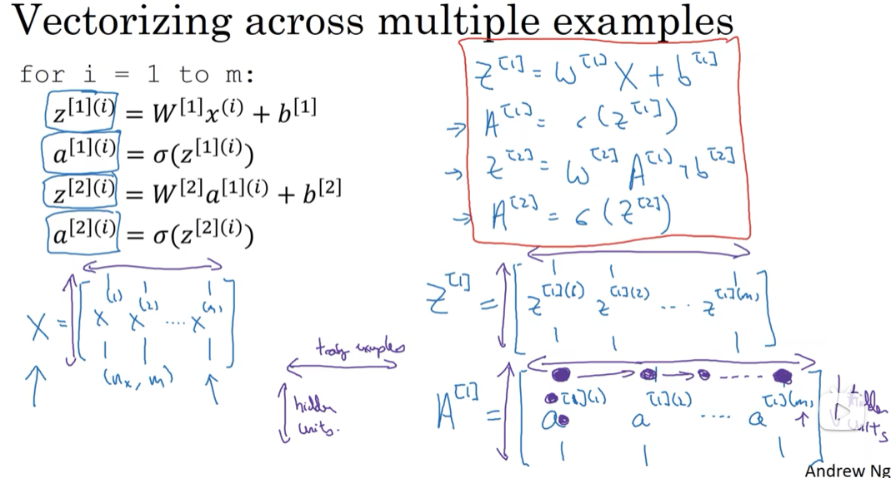

- w是个大矩阵  里面每个小w向量是转置过的。

**在垂直方向，这个垂直索引对应于神经网络中的不同节点。**例如，这个节点，该值位于矩阵的最左上角对应于激活单元，它是位于第一个训练样本上的第一个隐藏单元。它的下一个值对应于第二个隐藏单元的激活值。它是位于第一个训练样本上的，以及第一个训练示例中第三个隐藏单元，等等。

- 我：[1]表示第一层神经网络，即隐藏层。
- 网友：a[L](i)：第L层第i个样本，这个列向量的第j行就是第j个神经元
- 网友：神经网络具体有多少层，每层需要多少节点是自己设置的，没有固定的要求，但是有相对较好的规定

当垂直扫描，是索引到隐藏单位的数字。当水平扫描，将从第一个训练示例中从第一个隐藏的单元到第二个训练样本，第三个训练样本……直到节点对应于第一个隐藏单元的激活值，且这个隐藏单元是位于这$m$个训练样本中的最终训练样本。

**从水平上看，矩阵$A$代表了各个训练样本。从竖直上看，矩阵$A$的不同的索引对应于不同的隐藏单元。**

对于矩阵$Z，X$情况也类似，水平方向上，对应于不同的训练样本；竖直方向上，对应不同的输入特征，而这就是神经网络输入层中各个节点。 

神经网络上通过在多样本情况下的向量化来使用这些等式。

在下一个视频中，将证明为什么这是一种正确向量化的实现。这种证明将会与逻辑回归中的证明类似。

### 3.5 向量化实现的解释（Justification for vectorized implementation）

在上一个视频中，我们学习到如何将多个训练样本横向堆叠成一个矩阵$X$，然后就可以推导出神经网络中前向传播（**forward propagation**）部分的向量化实现。

在这个视频中，我们将会继续了解到，为什么上一节中写下的公式就是将多个样本向量化的正确实现。

我们先手动对几个样本计算一下前向传播，看看有什么规律：
公式3.16：
$z^{[1](1)} = W^{[1]}x^{(1)} + b^{[1]}$

$z^{[1](2)} = W^{[1]}x^{(2)} + b^{[1]}$

$z^{[1](3)} = W^{[1]}x^{(3)} + b^{[1]}$

这里**，为了描述的简便，我们先忽略掉 $b^{[1]}$后面你将会看到利用Python 的广播机制，可以很容易的将$b^{[1]}$ 加进来。**

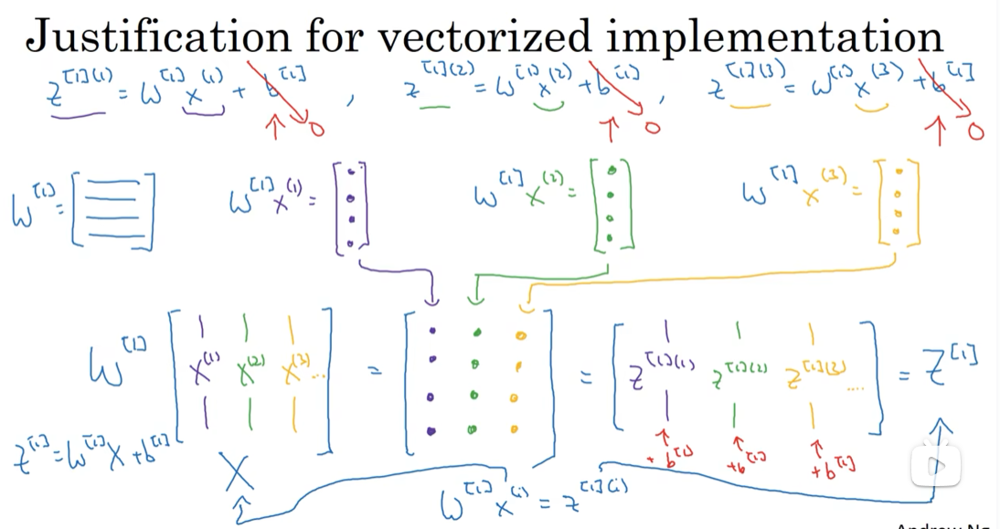

- 网友：下一层没说只有一个神经元啊，所以矩阵不能只有一列。
  - 网友：第一层的每个隐藏单元都有一行W值，这里是把所有W的值组成矩阵。
  - 我：W[1]应该是一个矩阵，横向看，从左到右是w1 w2...wn，表示单个神经网络结点上的逻辑回归公式的各个参数；纵向看，从上往下是同一隐藏层的不同结点。这样矩阵和列向量x(i)相乘后，得到的也是列向量，列向量的每个值即是上图的彩色小圆圈，小圆圈表示每个神经元的w*x(i)的结果。
- 网友：在[。]中，横向表示不同的样本，纵向代表的是隐藏单元。
- 网友：这分颜色的太贴心了。 

现在 $W^{[1]}$ 是一个矩阵，$x^{(1)},x^{(2)},x^{(3)}$都是列向量，矩阵乘以列向量得到列向量，下面将它们用图形直观的表示出来:
公式3.17：
$$
W^{[1]}  x =
		\left[
		\begin{array}{ccc}
		\cdots \\
		\cdots \\
		\cdots \\
		\end{array}
		\right]
		
		\left[
		\begin{array}{c}
		\vdots &\vdots & \vdots & \vdots \\
		x^{(1)} & x^{(2)} & x^{(3)} & \vdots\\
		\vdots &\vdots & \vdots & \vdots \\
		\end{array}
		\right]
		=
		\left[
		\begin{array}{c}
		\vdots &\vdots & \vdots & \vdots \\
		w^{(1)}x^{(1)} & w^{(1)}x^{(2)} & w^{(1)}x^{(3)} & \vdots\\
		\vdots &\vdots & \vdots & \vdots \\
		\end{array}
		\right]
		=\\
		\left[
		\begin{array}{c}
		\vdots &\vdots & \vdots & \vdots \\
		z^{[1](1)} & z^{[1](2)} & z^{[1](3)} & \vdots\\
		\vdots &\vdots & \vdots & \vdots \\
		\end{array}
		\right]
		=
		Z^{[1]}
$$

视频中，吴恩达老师很细心的用不同的颜色表示不同的样本向量，及其对应的输出。所以从图中可以看出，**当加入更多样本时，只需向矩阵$X$中加入更多列**。

所以从这里我们也可以了解到，为什么之前我们对单个样本的计算要写成
$z^{[1](i)} = W^{[1]}x^{(i)} + b^{[1]}$
这种形式，因为当有不同的训练样本时，将它们堆到矩阵$X$的各列中，那么它们的输出也就会相应的堆叠到矩阵 $Z^{[1]}$ 的各列中。现在我们就可以直接计算矩阵 $Z^{[1]}$ 加上$b^{[1]}$，因为列向量 $b^{[1]}$ 和矩阵 $Z^{[1]}$的列向量有着相同的尺寸，而**Python**的广播机制对于这种矩阵与向量直接相加的处理方式是，将向量与矩阵的每一列相加。
所以这一节只是说明了为什么公式 $Z^{[1]} =W^{[1]}X + \ b^{[1]}$是前向传播的第一步计算的正确向量化实现，但事实证明，类似的分析可以发现，前向传播的其它步也可以使用非常相似的逻辑，即如果将输入按列向量横向堆叠进矩阵，那么通过公式计算之后，也能得到成列堆叠的输出。

最后，对这一段视频的内容做一个总结:

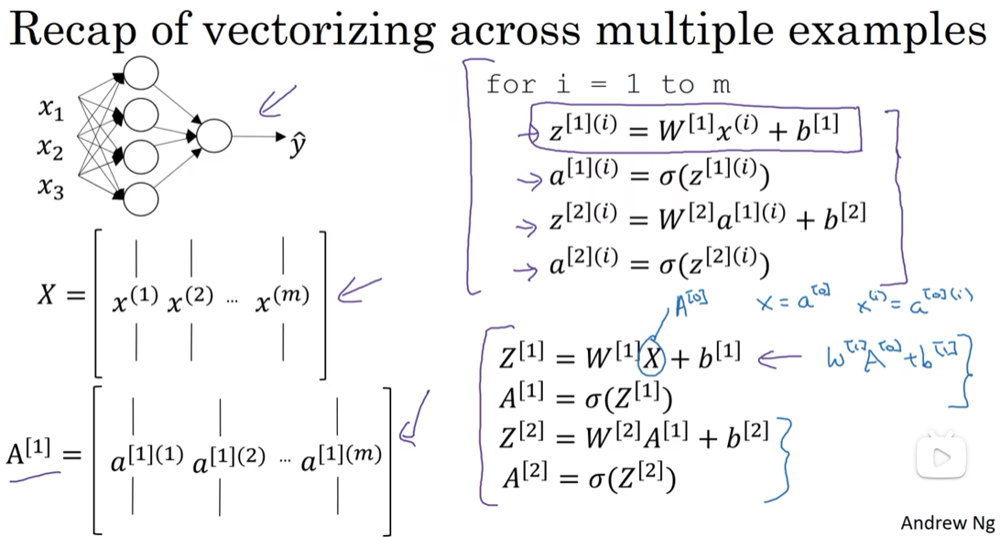

- 我：X是一个矩阵，纵向看是单个输入数据的各个维度的值，横向看是不同输入；A[i]也是矩阵，这样格式就对上了。
- 高赞网友：上图中右下部，X可以写成A[0]是因为X是第0层的激活值；a\[0](i)表示第0层激活值的第i列（这一列的每个值 即为不同维度的输入值），代表第i个初始数据样本。
  - 我理解：第0层的激活值，即第0层的输出。

由公式3.12、公式3.13、公式3.14、公式3.15可以看出，使用向量化的方法，可以不需要显示循环，而直接通过矩阵运算从$X$就可以计算出 $A^{[1]}$，实际上$X$可以记为 $A^{[0]}$，使用同样的方法就可以由神经网络中的每一层的输入 $A^{[i-1]}$ 计算输出 $A^{[i]}$。其实这些方程有一定对称性，其中第一个方程也可以写成$Z^{[1]} = W^{[1]}A^{[0]} + b^{[1]}$，你看这对方程，还有这对方程形式其实很类似，只不过这里所有指标加了1。所以这样就显示出神经网络的不同层次，你知道大概每一步做的都是一样的，或者只不过同样的计算不断重复而已。这里我们有一个双层神经网络，我们在下周视频里会讲深得多的神经网络，你看到随着网络的深度变大，基本上也还是重复这两步运算，只不过是比这里你看到的重复次数更多。在下周的视频中将会讲解更深层次的神经网络，**随着层数的加深，基本上也还是重复同样的运算**。

以上就是对神经网络向量化实现的正确性的解释，**到目前为止，我们仅使用sigmoid函数作为激活函数，事实上这并非最好的选择**，在下一个视频中，将会继续深入的讲解如何使用更多不同种类的激活函数。

### 3.6 激活函数（Activation functions）

使用一个神经网络时，需要决定使用哪种激活函数用隐藏层上，哪种用在输出节点上。到目前为止，之前的视频只用过**sigmoid**激活函数，但是，有时其他的激活函数效果会更好。

在神经网路的前向传播中，的$a^{[1]} = \sigma(z^{[1]})$和$a^{[2]} =\sigma(z^{[2]})$这两步会使用到**sigmoid**函数。**sigmoid**函数在这里被称为激活函数。
公式3.18：
$a = \sigma(z) = \frac{1}{{1 + e}^{- z}}$

更通常的情况下，使用不同的函数$g( z^{[1]})$，$g$可以是除了**sigmoid**函数以外的非线性函数。**tanh**函数或者双曲正切函数是总体上都优于**sigmoid**函数的激活函数。

如图，$a = tan(z)$的值域是位于+1和-1之间。
公式3.19：
$a= tanh(z) = \frac{e^{z} - e^{- z}}{e^{z} + e^{- z}}$

事实上，**tanh**函数是**sigmoid**的向下平移和伸缩后的结果。对它进行了变形后，穿过了$(0,0)$点，并且值域介于+1和-1之间。

结果表明，如果在隐藏层上使用函数
公式3.20：
$g(z^{[1]}) = tanh(z^{[1]}) $
效果总是优于**sigmoid**函数。因为函数值域在-1和+1的激活函数，其均值是更接近零均值的。在训练一个算法模型时，如果使用**tanh**函数代替**sigmoid**函数中心化数据，使得数据的平均值更接近0而不是0.5.

这会使下一层学习简单一点，在第二门课中会详细讲解。

在讨论优化算法时，有一点要说明：我基本已经不用**sigmoid**激活函数了，**tanh**函数在所有场合都优于**sigmoid**函数。

**但有一个例外：在二分类的问题中，对于输出层，因为$y$的值是0或1，所以想让$\hat{y}$的数值介于0和1之间，而不是在-1和+1之间。所以需要使用sigmoid激活函数**。这里的 
公式3.21：
$g(z^{[2]}) = \sigma(z^{[2]})$
在这个例子里看到的是，对隐藏层使用**tanh**激活函数，输出层使用**sigmoid**函数。

所以，在不同的神经网络层中，激活函数可以不同。为了表示不同的激活函数，在不同的层中，使用方括号上标来指出$g$上标为$[1]$的激活函数，可能会跟$g$上标为$[2]$不同。方括号上标$[1]$代表隐藏层，方括号上标$[2]$表示输出层。

**sigmoid函数和tanh函数两者共同的缺点是，在$z$特别大或者特别小的情况下，导数的梯度或者函数的斜率会变得特别小，最后就会接近于0，导致降低梯度下降的速度。**

在机器学习另一个很流行的函数是：修正线性单元的函数（**ReLu**），**ReLu**函数图像是如下图。
公式3.22：
$ a =max( 0,z) $
所以，只要$z$是正值的情况下，导数恒等于1，当$z$是负值的时候，导数恒等于0。从实际上来说，当使用$z$的导数时，**$z$=0的导数是没有定义的**。但是当编程实现的时候，$z$的取值刚好等于0.00000001的这个概率相当小，所以，在实践中，不需要担心这个值，$z$是等于0的时候，假设一个导数是1或者0效果都可以。

这有一些选择激活函数的经验法则：

如果输出是0、1值（二分类问题），则输出层选择**sigmoid**函数，然后其它的所有单元都选择**Relu**函数。

这是很多激活函数的默认选择，如果在隐藏层上不确定使用哪个激活函数，那么通常会使用**Relu**激活函数。有时，也会使用**tanh**激活函数，但**Relu**的一个优点是：当$z$是负值的时候，导数等于0。

这里也有另一个版本的**Relu**被称为**Leaky Relu**。

当$z$是负值时，这个函数的值不是等于0，而是轻微的倾斜，如图。

这个函数通常比**Relu**激活函数效果要好，尽管在实际中**Leaky ReLu**使用的并不多。

图3.6.1

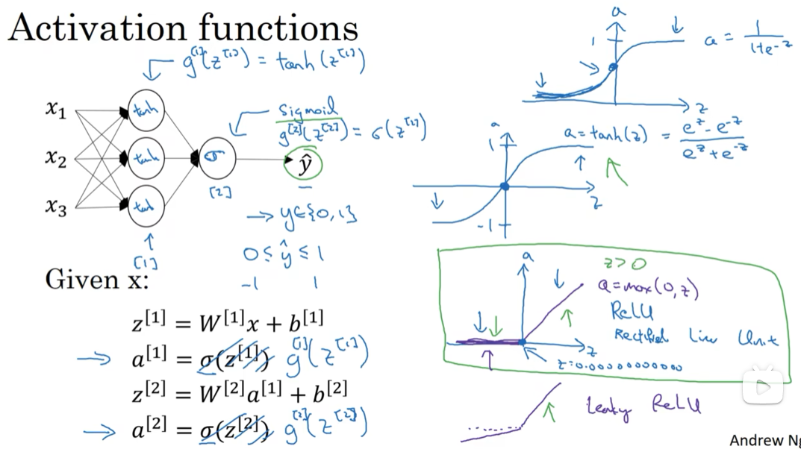

- 网友：如果用线性函数的话你求导一下就发现多个线性函数其实可以用一个线性函数代替，所以神经网络的深度就没用存在的意义。 ps：个人见解
- 网友：人脑神经元很复杂，而如果不用非线性激活函数，所进行的都是线性运算，无法进行更复杂特征的提取识别，所以需要非线性激活函数
- 网友问：为什么不用y=z？
  - 网友答：用y=z不还是回归问题么。。现在要变成二分类问题
  - 网友：线性的话一层就够了，多层没必要。
  - 网友：可以 但是那就是逻辑回归 弄成网络没有意义
  - 网友：什么回归问题，加激活函数是为了实现非线性，y=z是线性，你多少层网络不也都是线性组合么
  - 网友：激活函数是将上一层的输出进行非线性处理，如果不加激活函数，那么最后的输出就始终是输入层的线性组合，就没有训练的意义了，甚至可以直接回归去做了（下一小节也会讲这个问题）。
  - 我：[线性和非线性的区别](https://baike.baidu.com/item/%E7%BA%BF%E6%80%A7%E4%B8%8E%E9%9D%9E%E7%BA%BF%E6%80%A7/22412673#:~:text=%20%E7%BA%BF%E6%80%A7%E4%B8%8E%E9%9D%9E%E7%BA%BF%E6%80%A7%E7%9A%84%E4%B8%80%E4%B8%AA%E6%98%8E%E6%98%BE%E5%8C%BA%E5%88%AB%E6%98%AF%E5%8F%A0%E5%8A%A0%E6%80%A7%E6%98%AF%E5%90%A6%E6%9C%89%E6%95%88%E3%80%82%20%E5%9C%A8%E4%B8%80%E4%B8%AA%E7%B3%BB%E7%BB%9F%E4%B8%AD%EF%BC%8C%E5%A6%82%E6%9E%9C%E4%B8%A4%E4%B8%AA%E4%B8%8D%E5%90%8C%E5%9B%A0%E7%B4%A0%E7%9A%84%E7%BB%84%E5%90%88%E4%BD%9C%E7%94%A8%E5%8F%AA%E6%98%AF%E4%B8%A4%E4%B8%AA%E5%9B%A0%E7%B4%A0%E5%8D%95%E7%8B%AC%E4%BD%9C%E7%94%A8%E7%9A%84%E7%AE%80%E5%8D%95%E5%8F%A0%E5%8A%A0%EF%BC%8C%E8%BF%99%E7%A7%8D%E5%85%B3%E7%B3%BB%E6%88%96%E7%89%B9%E6%80%A7%E5%B0%B1%E6%98%AF%E7%BA%BF%E6%80%A7%E7%9A%84%E3%80%82,%E5%8F%8D%E4%B9%8B%EF%BC%8C%E5%A6%82%E6%9E%9C%E4%B8%80%E4%B8%AA%E7%B3%BB%E7%BB%9F%E4%B8%AD%E4%B8%80%E4%B8%AA%E5%BE%AE%E5%B0%8F%E7%9A%84%E5%9B%A0%E7%B4%A0%E8%83%BD%E5%A4%9F%E5%AF%BC%E8%87%B4%E7%94%A8%E5%AE%83%E7%9A%84%E5%B9%85%E5%80%BC%E6%97%A0%E6%B3%95%E8%A1%A1%E9%87%8F%E7%9A%84%E7%BB%93%E6%9E%9C%EF%BC%8C%E8%BF%99%E7%A7%8D%E5%85%B3%E7%B3%BB%E6%88%96%E7%89%B9%E6%80%A7%E5%B0%B1%E6%98%AF%E9%9D%9E%E7%BA%BF%E6%80%A7%E7%9A%84%E3%80%82%20%E7%9B%B8%E5%BA%94%E5%9C%B0%EF%BC%8C%E5%85%B7%E6%9C%89%E5%8F%A0%E5%8A%A0%E6%80%A7%E7%9A%84%E7%B3%BB%E7%BB%9F%EF%BC%8C%E6%98%AF%E7%BA%BF%E6%80%A7%E7%B3%BB%E7%BB%9F%EF%BC%9B%E5%8F%8D%E4%B9%8B%EF%BC%8C%E5%88%99%E5%B1%9E%E4%BA%8E%E9%9D%9E%E7%BA%BF%E6%80%A7%E7%B3%BB%E7%BB%9F%E3%80%82%20%5B1%5D)

两者的优点是：

第一，在$z$的区间变动很大的情况下，激活函数的导数或者激活函数的斜率都会远大于0，在程序实现就是一个**if-else**语句，而**sigmoid**函数需要进行浮点四则运算，在实践中，使用**ReLu**激活函数神经网络通常会比使用**sigmoid**或者**tanh**激活函数学习的更快。

第二，**sigmoid**和**tanh**函数的导数在正负饱和区的梯度都会接近于0，这会造成梯度弥散，而**Relu**和**Leaky ReLu**函数大于0部分都为常数，不会产生梯度弥散现象。(同时应该注意到的是，**Relu**进入负半区的时候，梯度为0，神经元此时不会训练，产生所谓的稀疏性，而**Leaky ReLu**不会有这问题)

$z$在**ReLu**的梯度一半都是0，但是，有足够的隐藏层使得z值大于0，所以对大多数的训练数据来说学习过程仍然可以很快。

快速概括一下不同激活函数的过程和结论。

**sigmoid**激活函数：除了输出层是一个二分类问题基本不会用它。

**tanh**激活函数：**tanh**是非常优秀的，几乎适合所有场合。

**ReLu**激活函数：最常用的默认函数，，如果不确定用哪个激活函数，就使用**ReLu**或者**Leaky ReLu**。公式3.23：
$a = max( 0.01z,z)$
为什么常数是0.01？当然，可以为学习算法选择不同的参数。

在选择自己神经网络的激活函数时，有一定的直观感受，在深度学习中的经常遇到一个问题：在编写神经网络的时候，会有很多选择：隐藏层单元的个数、激活函数的选择、初始化权值……这些选择想得到一个对比较好的指导原则是挺困难的。

鉴于以上三个原因，以及在工业界的见闻，提供一种直观的感受，哪一种工业界用的多，哪一种用的少。但是，自己的神经网络的应用，以及其特殊性，**是很难提前知道选择哪些效果更好。所以通常的建议是：如果不确定哪一个激活函数效果更好，可以把它们都试试，然后在验证集或者发展集上进行评价**。然后看哪一种表现的更好，就去使用它。

为自己的神经网络的应用测试这些不同的选择，会在以后检验自己的神经网络或者评估算法的时候，看到不同的效果。如果仅仅遵守使用默认的**ReLu**激活函数，而不要用其他的激励函数，那就可能在近期或者往后，每次解决问题的时候都使用相同的办法。

### 3.7 为什么需要非线性激活函数？（why need a nonlinear activation function?）

为什么神经网络需要非线性激活函数？**事实证明：要让你的神经网络能够计算出有趣的函数，你必须使用非线性激活函数**，证明如下：

这是神经网络正向传播的方程，现在我们去掉函数$g$，然后令$a^{[1]} = z^{[1]}$，**或者我们也可以令$g(z)=z$，这个有时被叫做线性激活函数（更学术点的名字是恒等激励函数，因为它们就是把输入值输出）**。为了说明问题我们把$a^{[2]} = z^{[2]}$，那么这个模型的输出$y$或仅仅只是输入特征$x$的线性组合。

如果我们改变前面的式子，令：
(1) $a^{[1]} = z^{[1]} = W^{[1]}x + b^{[1]}$

(2) $a^{[2]} = z^{[2]} = W^{[2]}a^{[1]}+ b^{[2]}$
将式子(1)代入式子(2)中，则：
$a^{[2]} = z^{[2]} = W^{[2]}(W^{[1]}x + b^{[1]}) + b^{[2]}$

(3) $a^{[2]} = z^{[2]} = W^{[2]}W^{[1]}x + W^{[2]}b^{[1]} + b^{[2]} $
简化多项式得
$a^{[2]} = z^{[2]} = W^{'}x + b^{'} $
如果你是用线性激活函数或者叫恒等激励函数，那么神经网络只是把输入线性组合再输出。

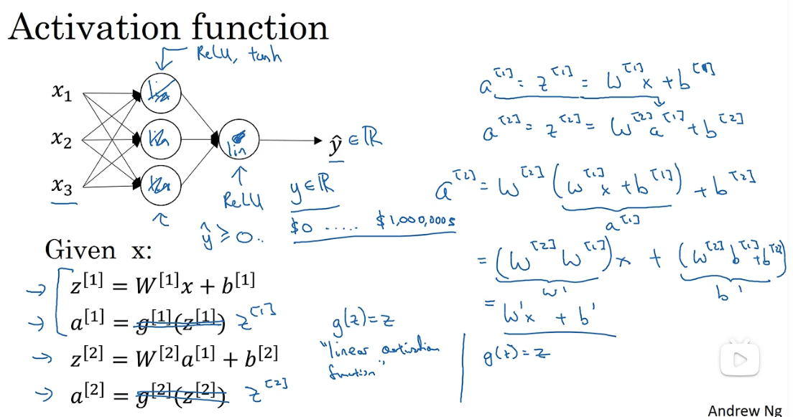

- 网友问：所以为什么很多层神经网络就能获得更好的效果呢？
  - 我：因为可以模拟各种有趣规律的输入输出吧
- 网友问：relu也是线性呀？
  - 网友答：relu是折线。 
  - 网友补充：多层relu叠加就是近似sigmoid这一部分可以看看李宏毅老师的视频作为补充。
- 高赞网友：可不可以理解成激活函数就是把输出结果限制在一个范围内？
  - 网友补充：激活函数是用来加入非线性因素的，因为线性模型的表达能力不够。现实中很多问题都是非线性的。
  - 网友补充：非线性改变了训练集的矩阵空间，把众多数据中具有同一特征的数据放置在了一起。

我们稍后会谈到深度网络，有很多层的神经网络，很多隐藏层。事实证明，如果你使用线性激活函数或者没有使用一个激活函数，那么无论你的神经网络有多少层一直在做的只是计算线性函数，所以不如直接去掉全部隐藏层。在我们的简明案例中，**事实证明如果你在隐藏层用线性激活函数，在输出层用sigmoid函数，那么这个模型的复杂度和没有任何隐藏层的标准Logistic回归是一样的**，如果你愿意的话，可以证明一下。

在这里线性隐层一点用也没有，因为这两个线性函数的组合本身就是线性函数，所以除非你引入非线性，否则你无法计算更有趣的函数，即使你的网络层数再多也不行；**只有一个地方可以使用线性激活函数------$g(z)=z$，就是你在做机器学习中的回归问题**。$y$ 是一个实数，举个例子，比如你想预测房地产价格，$y$ 就不是二分类任务0或1，而是一个实数，从0到正无穷。如果$y$ 是个实数，那么在输出层用线性激活函数也许可行，你的输出也是一个实数，从负无穷到正无穷。

总而言之，不能在隐藏层用线性激活函数，可以用**ReLU**或者**tanh**或者**leaky ReLU**或者其他的**非线性激活函数**，**唯一可以用线性激活函数的通常就是输出层**；除了这种情况，会在隐层用线性函数的，除了一些特殊情况，比如与压缩有关的，那方面在这里将不深入讨论。在这之外，在隐层使用线性激活函数非常少见。因为房价都是非负数，所以我们也可以在输出层使用**ReLU**函数这样你的$\hat{y}$都大于等于0。

- 我：[线性函数和非线性函数的区别](https://blog.csdn.net/weixin_48615832/article/details/108910724)

理解为什么使用非线性激活函数对于神经网络十分关键，接下来我们讨论梯度下降，并在下一个视频中开始讨论梯度下降的基础——激活函数的导数。

### 3.8 激活函数的导数（Derivatives of activation functions）

在神经网络中使用反向传播的时候，你真的需要计算激活函数的斜率或者导数。针对以下四种激活，求其导数如下：

1）**sigmoid activation function**

图3.8.1

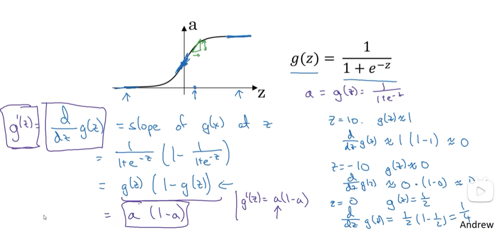

其具体的求导如下：
公式3.25：
$\frac{d}{dz}g(z) = {\frac{1}{1 + e^{-z}} (1-\frac{1}{1 + e^{-z}})}=g(z)(1-g(z))$

注：

当$z$ = 10或$z= -10$ ; $\frac{d}{dz}g(z)\approx0$

当$z $= 0 , $\frac{d}{dz}g(z)\text{=g(z)(1-g(z))=}{1}/{4}$

在神经网络中$a= g(z)$; $g{{(z)}^{'}}=\frac{d}{dz}g(z)=a(1-a)$

2) **Tanh activation function**

图3.8.2

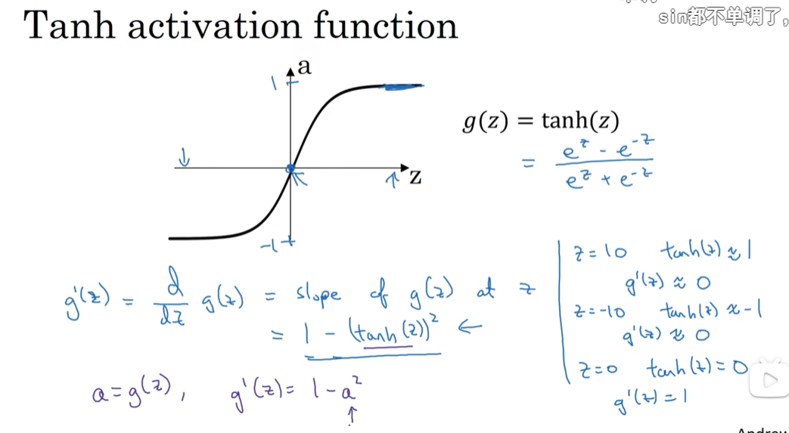

其具体的求导如下：
公式3.26：
$g(z) = tanh(z) = \frac{e^{z} - e^{-z}}{e^{z} + e^{-z}} $

公式3.27：
$\frac{d}{{d}z}g(z) = 1 - (tanh(z))^{2}$
注：

当$z$ = 10或$z= -10$  $\frac{d}{dz}g(z)\approx0$

当$z$ = 0,  $\frac{d}{dz}g(z)\text{=1-(0)=}1$

在神经网络中;

3）**Rectified Linear Unit (ReLU)**

$g(z) =max (0,z)$

$$
g(z)^{'}=
  \begin{cases}
  0&	\text{if z < 0}\\
  1&	\text{if z > 0}\\
undefined&	\text{if z = 0}
\end{cases}
$$

**注：通常在$z$= 0的时候给定其导数1；当然$z$=0的情况很少**

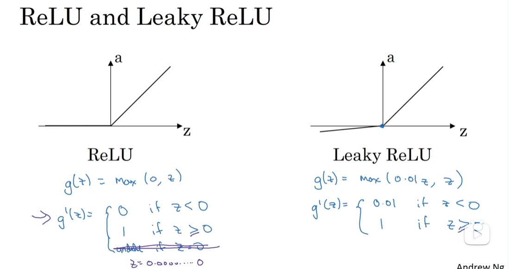

4）**Leaky linear unit (Leaky ReLU)**

与**ReLU**类似
$$
g(z)=\max(0.01z,z) \\
	\\
	\\
g(z)^{'}=
\begin{cases}
0.01& 	\text{if z < 0}\\
1&	\text{if z > 0}\\
undefined&	\text{if z = 0}
\end{cases}
$$

注：通常在$z = 0$的时候给定其导数1,0.01；当然$z=0$的情况很少。

### 3.9 神经网络的梯度下降（Gradient descent for neural networks）

在这个视频中，我会给你实现反向传播或者说梯度下降算法的方程组，在下一个视频我们会介绍为什么这几个特定的方 程是针对你的神经网络实现梯度下降的正确方程。

你的单隐层神经网络会有$W^{[1]}$，$b^{[1]}$，$W^{[2]}$，$b^{[2]}$这些参数，还有个$n_x$表示输入特征的个数，$n^{[1]}$表示隐藏单元个数，$n^{[2]}$表示输出单元个数。

在我们的例子中，我们只介绍过的这种情况，那么参数:

矩阵$W^{[1]}$的**维度**就是($n^{[1]}, n^{[0]}$)，$b^{[1]}$就是$n^{[1]}$维向量，可以写成$(n^{[1]}, 1)$，就是一个的列向量。
矩阵$W^{[2]}$的维度就是($n^{[2]}, n^{[1]}$)，$b^{[2]}$的维度就是$(n^{[2]},1)$维度。

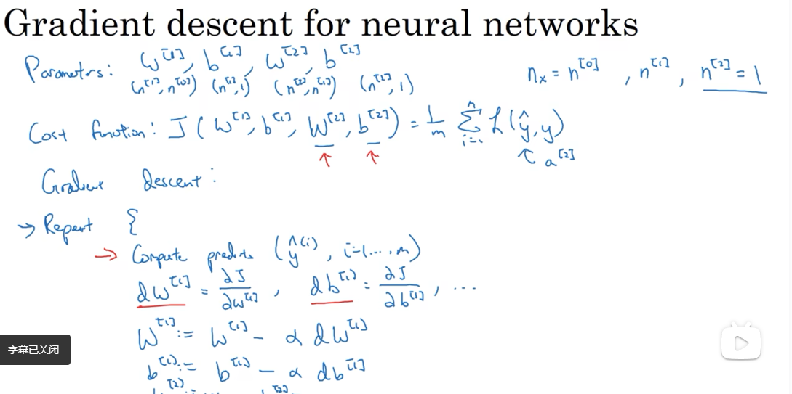

- 网友：这里的n指的是什么？
  - 网友：n指的是每层神经元的数量。n0是输入层元素个数,n1是第一层隐藏单元个数。
- 网友问：截图最下面，怎么可以一边是微分，一边是微商相等啊？
  - 网友：这个符号不是微分的意思，回去看看别人是怎么约定的。前面的人是不是看漏了老师讲的符号表示。dW[1]是python代码的写法，真实表示含义就是等号右边的dJ/dW[1]。
- 高赞网友：兄弟们，不要想着去吧矩阵变现出来，只需要讲其看作一个数。
- 高赞网友：一次梯度下降其实就是可以理解为对损失函数的优化，这个过程会将每一层的参数进行更新，直至找到局部最优。

你还有一个神经网络的成本函数，假设你在做二分类任务，那么你的成本函数等于：

**Cost function**:
公式：
$J(W^{[1]},b^{[1]},W^{[2]},b^{[2]}) = {\frac{1}{m}}\sum_{i=1}^mL(\hat{y}, y)$
**loss function**和之前做**logistic**回归完全一样。

训练参数需要做梯度下降，在训练神经网络的时候，随机初始化参数很重要，而不是初始化成全零。当你参数初始化成某些值后，每次梯度下降都会循环计算以下预测值：

$\hat{y}^{(i)},(i=1,2,…,m)$
公式3.28：
$dW^{[1]} = \frac{dJ}{dW^{[1]}},db^{[1]} = \frac{dJ}{db^{[1]}}$
公式3.29：
${d}W^{[2]} = \frac{{dJ}}{dW^{[2]}},{d}b^{[2]} = \frac{dJ}{db^{[2]}}$

其中

公式3.30：
$W^{[1]}\implies{W^{[1]} - adW^{[1]}},b^{[1]}\implies{b^{[1]} -adb^{[1]}}$

公式3.31：
$W^{[2]}\implies{W^{[2]} - \alpha{\rm d}W^{[2]}},b^{[2]}\implies{b^{[2]} - \alpha{\rm d}b^{[2]}}$

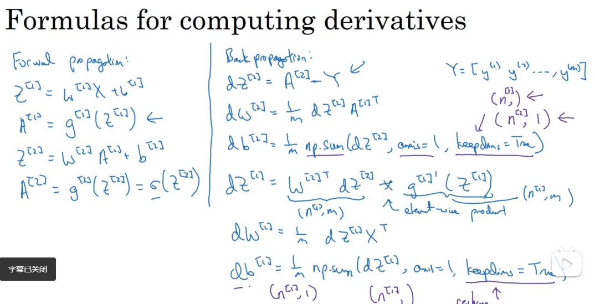

- 网友：这里dz[1]两个矩阵是对应位置相乘（element product）
- 网友：说白了这就是高等数学链式求导法则和线性代数矩阵运算的结合。

正向传播方程如下（之前讲过）：

**forward propagation**：
(1)
$z^{[1]} = W^{[1]}x + b^{[1]}$
(2)
$a^{[1]} = \sigma(z^{[1]})$
(3)
$z^{[2]} = W^{[2]}a^{[1]} + b^{[2]}$
(4)
$a^{[2]} = g^{[2]}(z^{[z]}) = \sigma(z^{[2]})$

反向传播方程如下:

**back propagation**：
公式3.32：
$ dz^{[2]} = A^{[2]} - Y , Y = \begin{bmatrix}y^{[1]} & y^{[2]} & \cdots & y^{[m]}\\ \end{bmatrix} $
公式3.33：
$ dW^{[2]} = {\frac{1}{m}}dz^{[2]}A^{[1]T} $
公式3.34：
$ {\rm d}b^{[2]} = {\frac{1}{m}}np.sum({d}z^{[2]},axis=1,keepdims=True)$
公式3.35：
$ dz^{[1]} = \underbrace{W^{[2]T}{\rm d}z^{[2]}}_{(n^{[1]},m)}\quad*\underbrace{{g^{[1]}}^{'}}_{activation \; function \; of \; hidden \; layer}*\quad\underbrace{(z^{[1]})}_{(n^{[1]},m)} $
公式3.36：
$dW^{[1]} = {\frac{1}{m}}dz^{[1]}x^{T}$
公式3.37：
${\underbrace{db^{[1]}}_{(n^{[1]},1)}} = {\frac{1}{m}}np.sum(dz^{[1]},axis=1,keepdims=True)$

上述是反向传播的步骤，注：这些都是针对所有样本进行过向量化，$Y$是$1×m$的矩阵；这里`np.sum`是python的numpy命令，`axis=1`表示水平相加求和，**`keepdims`是防止python输 出那些古怪的秩数$(n,)$**，加上这个确保阵矩阵$db^{[2]}$这个向量输出的维度为$(n,1)$这样标准的形式。 

目前为止，我们计算的都和**Logistic**回归十分相似，但当你开始计算反向传播时，你需要计算，是隐藏层函数的导数，输出在使用**sigmoid**函数进行二元分类。这里是进行逐个元素乘积，因为$W^{[2]T}dz^{[2]}$和$(z^{[1]})$这两个都为$(n^{[1]},m)$矩阵；

还有一种防止**python**输出奇怪的秩数，需要显式地调用`reshape`把`np.sum`输出结果写成矩阵形式。

以上就是正向传播的4个方程和反向传播的6个方程，这里我是直接给出的，在下个视频中，我会讲如何导出反向传播的这6个式子的。如果你要实现这些算法，你必须正确执行正向和反向传播运算，你必须能计算所有需要的导数，用梯度下降来学习神经网络的参数；你也可以许多成功的深度学习从业者一样直接实现这个算法，不去了解其中的知识。

### 3.10（选修）直观理解反向传播（Backpropagation intuition）

这个视频主要是推导反向传播。

下图是逻辑回归的推导：

- 我：截图下部的da/dz其实就是激活函数针对z求导，所以会表示为g’(z)，因为这里g(z)就代表激活函数；之所以要用g(z)而不是sigma表示，是因为激活函数除了sigma，还有relu，tanh等等，所以用g(z)统一代表激活函数。

回想一下逻辑回归的公式(参考公式3.2、公式3.5、公式3.6、公式3.15)
公式3.38：
$$
\left.
	\begin{array}{l}
	{x }\\
	{w }\\
	{b }
	\end{array}
	\right\}
	\implies{z={w}^Tx+b}
	\implies{\alpha = \sigma(z)} 
	\implies{{L}\left(a,y \right)}
$$
所以回想当时我们讨论逻辑回归的时候，我们有这个正向传播步骤，其中我们计算$z$，然后$a$，然后损失函数$L$。

公式3.39：
$$
\underbrace{
	\left.
	\begin{array}{l}
	{x }\\
	{w }\\
	{b }
	\end{array}
	\right\}
	}_{dw={dz}\cdot x, db =dz}
	\impliedby\underbrace{{z={w}^Tx+b}}_{dz=da\cdot g^{'}(z),
	g(z)=\sigma(z),
	{\frac{{dL}}{dz}}={\frac{{dL}}{da}}\cdot{\frac{da}{dz}},
	{\frac{d}{ dz}}g(z)=g^{'}(z)}
	\impliedby\underbrace{{a = \sigma(z)} 
	\impliedby{L(a,y)}}_{da={\frac{{d}}{da}}{L}\left(a,y \right)=(-y\log{\alpha} - (1 - y)\log(1 - a))^{'}={-\frac{y}{a}} + {\frac{1 - y}{1 - a}{}} }
$$

- 网友：对的 之前讲过课程里面的log默认以e为底
- 网友：知道求导规则的，注意dz，da是dL/dz，dL/da，log是e为底，其他的就正常了

神经网络的计算中，与逻辑回归十分类似，但中间会有多层的计算。下图是一个双层神经网络，有一个输入层，一个隐藏层和一个输出层。

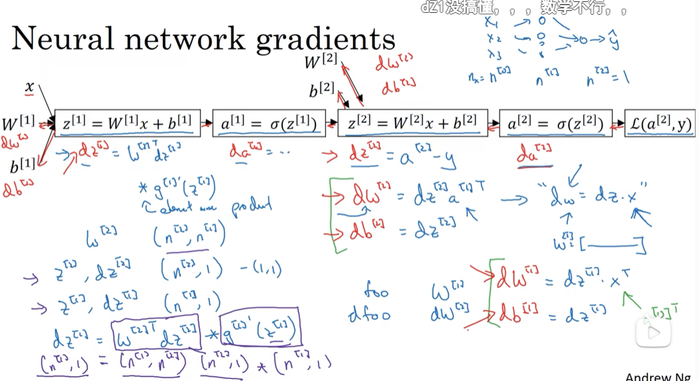

- 网友：小w是列向量，大W是小w转置叠起来的
- 网友：这里的逐元素乘积*保证矩阵维度不变，其实就是每个元素都是需要进行一次这样的求导操作，因为前向传播时激活函数就是针对每个元素进行的操作
- 网友问：啥玩意儿，截图最下面的两个列向量怎么乘？？
  - 网友答：对应元素相乘，这不是矩阵乘法。*表示两矩阵中元素逐个对应相乘，不要和dot（）混淆。
  - 我：这里是针对单个输入数据做考虑，所以截图最上面是小写的x，这也就解释了截图下部为什么dz[2]的列数为1。  
    - 网友吐槽：才知道之前是单个样本，一直当多样本推的，头都晕了
- 网友：利用链式法则求导，先求da【1】，再求dz【1】。dz^[1]自己求个导化简一下就出来了，光听觉得难，写一下真不难。**dz1=(dL/dz2)*(dz2/da1)*(da1/dz1)**。

总结上图，我们**在左侧**得到了每次训练单个训练样本的反向传播；在右侧是向量化的前向传播，这样我们不用一个个样本来算：

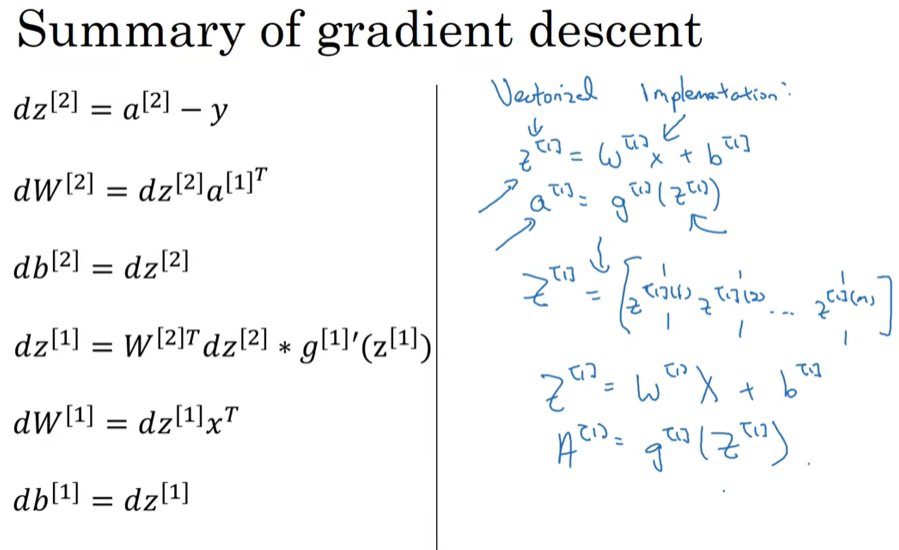

下图右侧是  多样本同时处理时 反向传播的向量化表示：

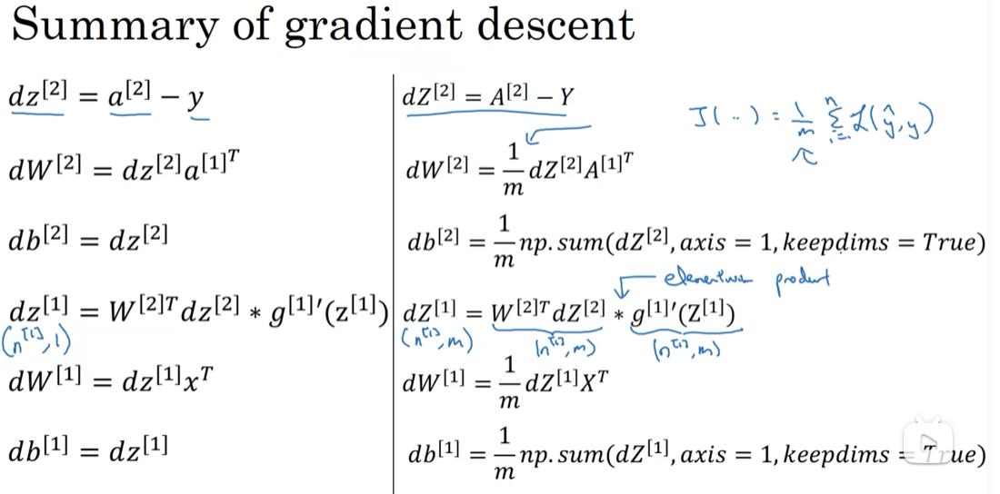

- 网友： 损失函数累加了误差变大了，损失函数不应该累加，而是使他接近一个值。所以要求平均
  - 网友：成本代价函数是针对整体而言的,所以更新参数时要乘1/m,逻辑回归的部分有讲
  - 网友：J就是均值误差  求导还是会有1/m。
  - 网友：W是不随着样本增加而增加列的，只会在原来的基础上不断累积，而损失函数求得是平均，所以这里要加1/m
- 网友：这回又开始多样本了
- 网友：element product来乘积是因为求导链式法则。dz1的计算还需要矩阵求导相关的知识，那个元素相乘不是链式求导就容易得出的
  - 我：可以参考大佬笔记：https://blog.csdn.net/weixin_36815313/article/details/105341107。虽然大佬也没有一步步求矩阵的链式法则。不过文章最后说不看懂没关系，先跳过数学细节吧，有点直觉先就行。

> 关于Z[1]的自己推导

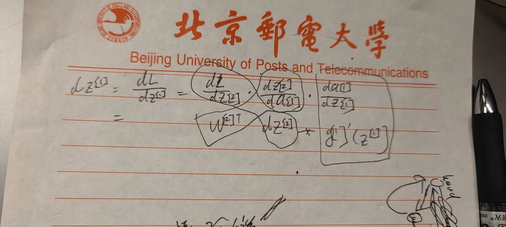

- 我：至于为什么链式过程中要交换顺序，可能是因为矩阵维度的要求，在矩阵链式求导时不能像标量一样直接套用链式法则，还得考虑位置的因素。[参考文章](https://zhuanlan.zhihu.com/p/241028378)

前向传播：

计算$z^{[1]}$，$a^{[1]}$，再计算$z^{[2]}$，$a^{[2]}$，最后得到**loss function**。

反向传播：

向后推算出$da^{[2]}$，然后推算出$dz^{[2]}$，接着推算出$da^{[1]}$，然后推算出$dz^{[1]}$。我们不需要对$x$求导，因为$x$是固定的，我们也不是想优化$x$。向后推算出$da^{[2]}$，然后推算出$dz^{[2]}$的步骤可以合为一步：
公式3.40：
$dz^{[2]}=a^{[2]}-y\;，\;dW^{[2]}=dz^{[2]}{a^{[1]}}^{T}$
(注意：逻辑回归中；为什么$a^{[1]T}$多了个转置：$dw$中的$W$(视频里是$W^{[2]}_i$)是一个列向量，而$W^{[2]}$是个行向量，故需要加个转置);
公式3.41：
$db^{[2]}=dz^{[2]}$
公式3.42：
$dz^{[1]} = W^{[2]T}dz^{[2]}* g[1]^{'}(z^{[1]})$
注意：这里的矩阵：$W^{[2]}$的维度是：$(n^{[2]},n^{[1]})$。

$z^{[2]}$ ， $dz^{[2]}$的维度都是：$(n^{[2]},1)$，如果是二分类，那维度就是$(1,1)$。

$z^{[1]}$，$dz^{[1]}$的维度都是：$(n^{[1]},1)$。

证明过程：
见公式3.42，其中$W^{[2]T}dz^{[2]}$维度为：$(n^{[1]},n^{[2]})$、$(n^{[2]},1)$相乘得到$(n^{[1]},1)$，和$z^{[1]}$维度相同，

$g[1]^{'}(z^{[1]})$的维度为$(n^{[1]},1)$，这就变成了两个都是$(n^{[1]},1)$向量逐元素乘积。

实现后向传播有个技巧，就是要保证矩阵的维度相互匹配。最后得到$dW^{[1]}$和$db^{[1]}$，公式3.43：
$dW^{[1]} =dz^{[1]}x^{T},db^{[1]} = dz^{[1]}$

可以看出$dW^{[1]}$ 和$dW^{[2]}$ 非常相似，其中$x$扮演了$a^{[0]}$的角色，$x^{T}$ 等同于$a^{[0]T}$。

由：
$Z^{[1]} = W^{[1]}x + b^{[1]}\;,\;a^{[1]}=g^{[1]}(Z^{[1]})$
得到：
$Z^{[1]} = W^{[1]}x + b^{[1]}, A^{[1]} = g^{[1]}(Z^{[1]})$
$$
Z^{[1]} =
	\left[
		\begin{array}{c}
		\vdots &\vdots & \vdots & \vdots \\
		z^{[1](1)} & z^{[1](2)} & \vdots & z^{[1](m)} \\
		\vdots &\vdots & \vdots & \vdots \\
		\end{array}
		\right]
$$
注意：大写的$Z^{[1]}$表示$z^{[1](1)},z^{[1](2)},z^{[1](3)}...z^{[1](m)}$的列向量堆叠成的矩阵，以下类同。

下图写了主要的推导过程：
公式3.44：
$dZ^{[2]}=A^{[2]}-Y\;，\;dW^{[2]}={\frac{1}{m}}dZ^{[2]}{A^{[1]}}^{T}$
公式3.45：
$L = {\frac{1}{m}}\sum_i^n{L(\hat{y},y)}$
公式3.46：
$db^{[2]} = {\frac{1}{m}}np.sum(dZ^{[2]},axis=1,keepdims=True)$
公式3.47：
$\underbrace{dZ^{[1]}}_{(n^{[1]}, m)} = \underbrace{W^{[2]T}dZ^{[2]}}_{(n^{[1]}, m)}*\underbrace{g[1]^{'}(Z^{[1]})}_{(n^{[1]}, m)}$
公式3.48：
$dW^{[1]} = {\frac{1}{m}}dZ^{[1]}x^{T}$
公式3.49：
$db^{[1]} = {\frac{1}{m}}np.sum(dZ^{[1]},axis=1,keepdims=True) $

吴恩达老师认为反向传播的推导是机器学习领域最难的数学推导之一，矩阵的导数要用链式法则来求，如果这章内容掌握不了也没大的关系，只要有这种直觉就可以了。还有一点，就是初始化你的神经网络的权重，不要都是0，而是随机初始化，下一章将详细介绍原因。

### 3.11 随机初始化（Random+Initialization）

当你训练神经网络时，权重随机初始化是很重要的。**对于逻辑回归，把权重初始化为0当然也是可以的。但是对于一个神经网络，如果你把权重或者参数都初始化为0，那么梯度下降将不会起作用**。

让我们看看这是为什么。有两个输入特征，$n^{[0]} = 2$，2个隐藏层单元$n^{[1]}$就等于2。
因此与一个隐藏层相关的矩阵，或者说$W^{[1]}$是2\*2的矩阵，假设把它初始化为0的2\*2矩阵，$b^{[1]}$也等于 $[0\;0]^T$，**把偏置项$b$初始化为0是合理的，但是把$w$初始化为0就有问题了**。
那这个问题如果按照这样初始化的话，你总是会发现$a_{1}^{[1]}$ 和 $a_{2}^{[1]}$相等，这个激活单元和这个激活单元就会一样。因为两个隐含单元计算同样的函数，当你做反向传播计算时，这会导致$\text{dz}_{1}^{[1]}$ 和 $\text{dz}_{2}^{[1]}$也会一样，对称这些隐含单元会初始化得一样，这样输出的权值也会一模一样，由此$W^{[2]}$等于$[0\;0]$；

图3.11.1
但是如果你这样初始化这个神经网络，那么这两个隐含单元就会完全一样，因此他们完全对称，也就意味着计算同样的函数，并且肯定的是最终经过每次训练的迭代，这两个隐含单元仍然是同一个函数，令人困惑。$dW$会是一个这样的矩阵，每一行有同样的值因此我们做权重更新把权重$W^{[1]}\implies{W^{[1]}-adW}$每次迭代后的$W^{[1]}$，第一行等于第二行。

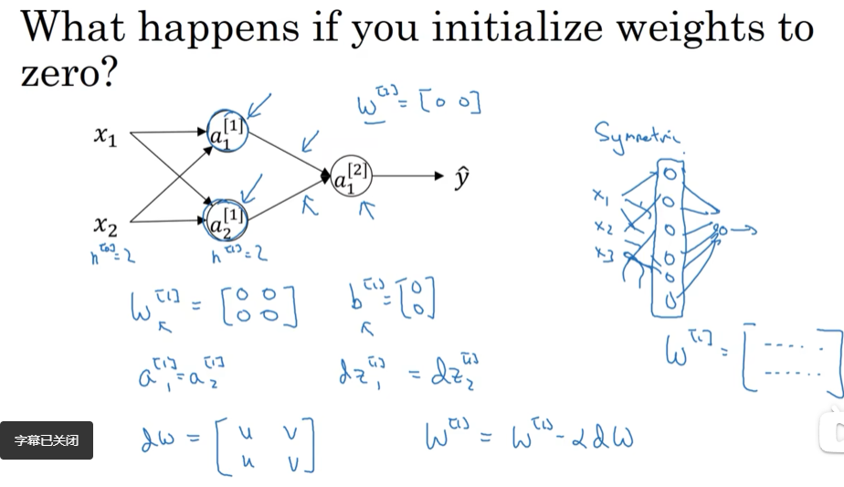

- 网友：我的理解是等于把输入数据的特征全部抹掉了
  - 网友反驳：初始化为零不会抹去特征，因为后续迭代w就不一定为零了，但如果是相同值，那每个单元计算都一样，就不可以了
  - 网友：感觉是，只要是完全对称，那不管有多少神经元，每一层其实就相当于只有一个
  - 网友：学习率对同一层所有节点都是一致的。
- 网友：w的行数决定了他在下一层的神经元数量，他的列数代表正在计算的输入的参数数量

由此可以推导，如果你把权重都初始化为0，那么由于隐含单元开始计算同一个函数，所有的隐含单元就会对输出单元有同样的影响。一次迭代后同样的表达式结果仍然是相同的，即隐含单元仍是对称的。通过推导，两次、三次、无论多少次迭代，不管你训练网络多长时间，隐含单元仍然计算的是同样的函数。因此这种情况下超过1个隐含单元也没什么意义，因为他们计算同样的东西。当然更大的网络，比如你有3个特征，还有相当多的隐含单元。

如果你要初始化成0，由于所有的隐含单元都是对称的，无论你运行梯度下降多久，他们一直计算同样的函数。这没有任何帮助，因为你想要两个不同的隐含单元计算不同的函数，**这个问题的解决方法就是随机初始化参数**。你应该这么做：把$W^{[1]}$设为`np.random.randn(2,2)`(生成高斯分布)，通常再乘上一个小的数，比如0.01，这样把它初始化为很小的随机数。**然后$b$没有这个对称的问题（叫做symmetry breaking problem），所以可以把 $b$ 初始化为0**，因为只要随机初始化$W$你就有不同的隐含单元计算不同的东西，因此不会有**symmetry breaking**问题了。相似的，对于$W^{[2]}$你可以随机初始化，$b^{[2]}$可以初始化为0。

$W^{[1]} = np.random.randn(2,2)\;*\;0.01\;,\;b^{[1]} = np.zeros((2,1))$
$W^{[2]} = np.random.randn(2,2)\;*\;0.01\;,\;b^{[2]} = 0$

你也许会疑惑，这个常数从哪里来，**为什么是0.01，而不是100或者1000。我们通常倾向于初始化为很小的随机数**。因为如果你用**tanh**或者**sigmoid**激活函数，或者说只在输出层有一个**Sigmoid**，如果（数值）波动太大，当你计算激活值时$z^{[1]} = W^{[1]}x + b^{[1]}\;,\;a^{[1]} = \sigma(z^{[1]})=g^{[1]}(z^{[1]})$如果$W$很大，$z$就会很大或者很小，因此这种情况下你很可能停在**tanh**/**sigmoid**函数的平坦的地方(见图3.8.2)，这些地方梯度很小也就意味着梯度下降会很慢，因此学习也就很慢。

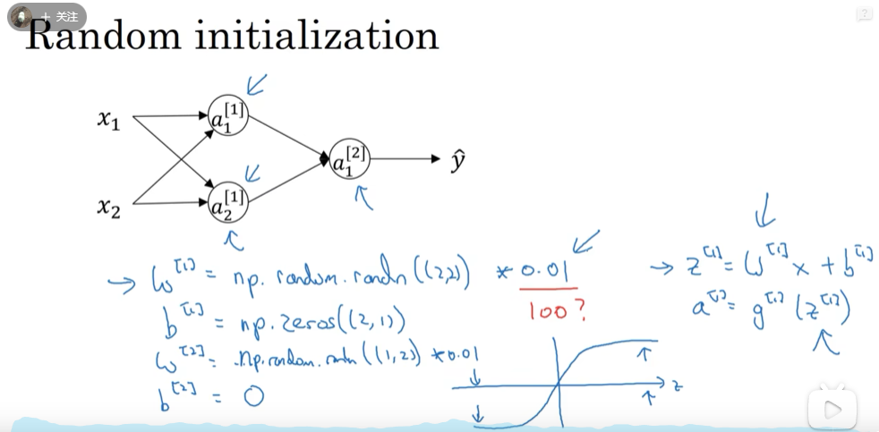

- 网友：权重初始化要小一点 不然会减慢学习速度。
- 网友：随机取，然后训练，迭代出最优解，神经网络就是干这个的
- 网友：初始权重可以不随机,都取很小的值吗
  - 网友：可以是可以，但是你代码咋写呢，我要1000个hidden unit，你是一个个敲给我吗

回顾一下：如果$w$很大，那么你很可能最终停在（甚至在训练刚刚开始的时候）$z$很大的值，这会造成**tanh**/**Sigmoid**激活函数饱和在龟速的学习上，如果你没有**sigmoid**/**tanh**激活函数在你整个的神经网络里，就不成问题。但如果你做二分类并且你的输出单元是**Sigmoid**函数，那么你不会想让初始参数太大，因此这就是为什么乘上0.01或者其他一些小数是合理的尝试。对于$w^{[2]}$一样，就是`np.random.randn((1,2))`，我猜会是乘以0.01。

事实上有时有比0.01更好的常数，当你训练一个只有一层隐藏层的网络时（这是相对浅的神经网络，没有太多的隐藏层），设为0.01可能也可以。但当你训练一个非常非常深的神经网络，你可能要试试0.01以外的常数。下一节课我们会讨论怎么并且何时去选择一个不同于0.01的常数，但是无论如何它通常都会是个相对小的数。

好了，这就是这周的视频。你现在已经知道如何建立一个一层的神经网络了，初始化参数，用前向传播预测，还有计算导数，结合反向传播用在梯度下降中。 
